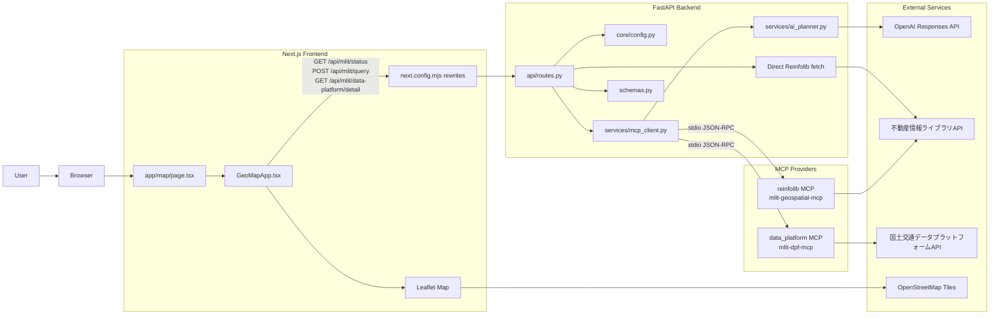
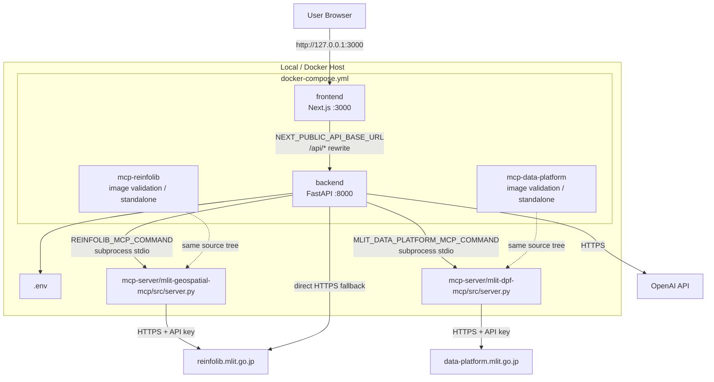
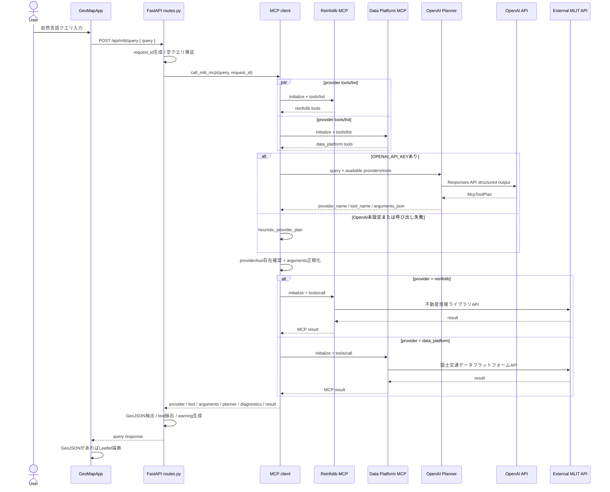
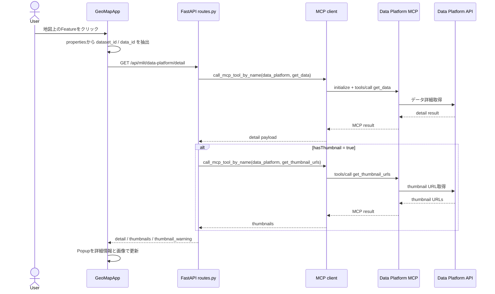
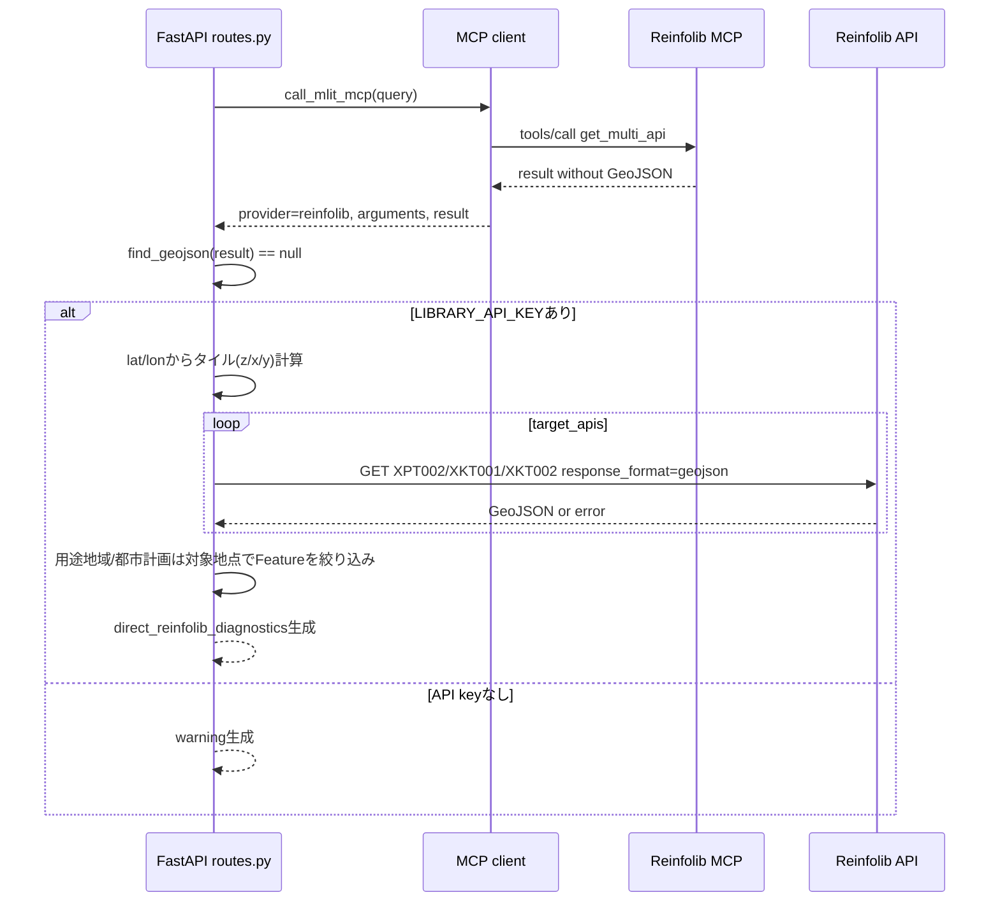
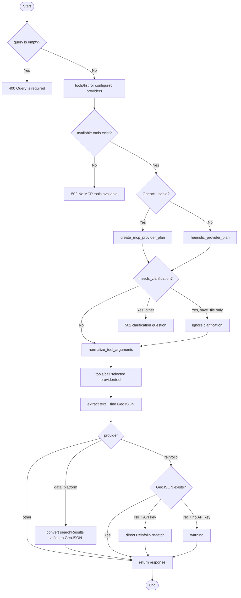
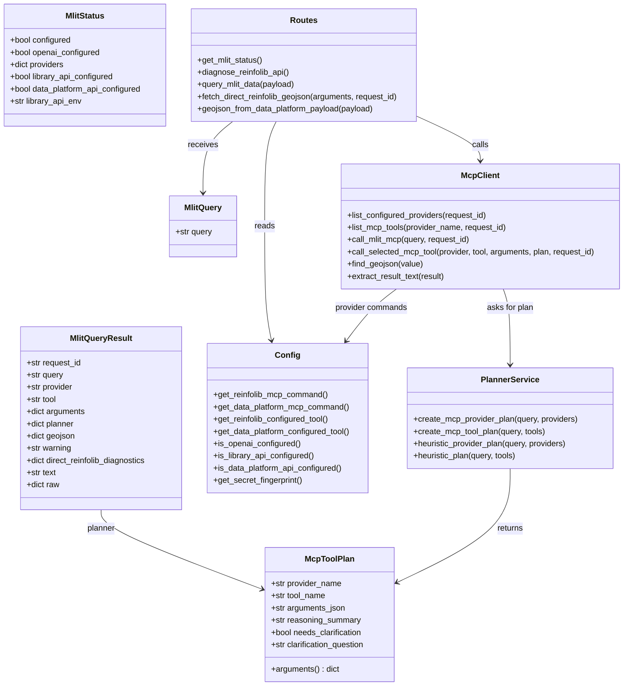
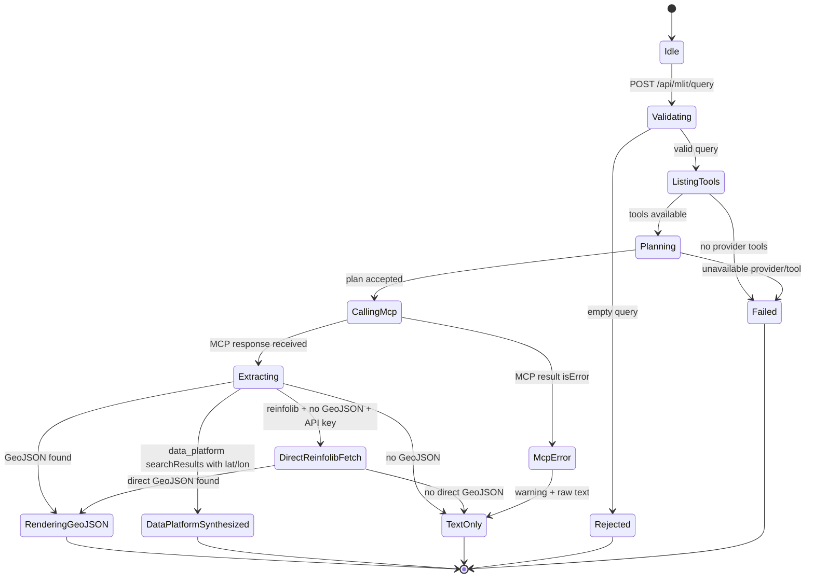
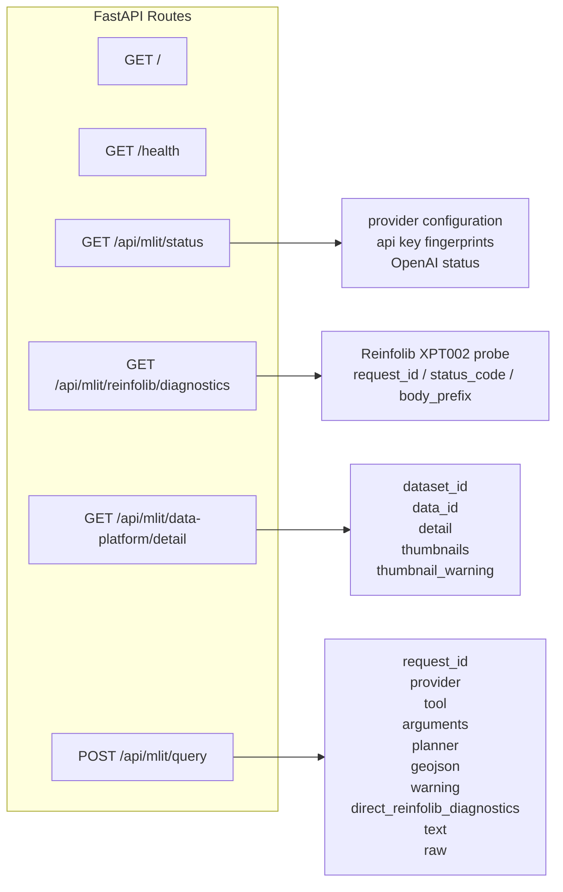

# GeoAI App システム設計図

## 目的

GeoAI App は、自然言語クエリを OpenAI Planner で解釈し、不動産情報ライブラリMCP (`reinfolib`) と国土交通データプラットフォームMCP (`data_platform`) を使い分けて地理空間データを取得する Web 地図アプリです。

FastAPI が MCP クライアントとして動作し、MCP の `tools/list` 結果とユーザークエリを OpenAI Planner に渡します。Planner は `provider_name`、`tool_name`、`arguments_json` を返し、FastAPI が選択された MCP ツールを `tools/call` します。

開発用サンプルGeoJSONへのフォールバックはありません。MCPレスポンスだけでGeoJSONが得られない場合、不動産情報ライブラリ系に限り、同じ引数から不動産情報ライブラリAPIを直接再取得して地図表示を試みます。

## Component UML

## Deployment UML

## Sequence UML: Query

## Sequence UML: Data Platform Popup Detail

## Sequence UML: Reinfolib Direct Re-fetch

## Activity UML: Query Processing

## Class UML

## State UML: Query Response

## API UML

## Environment

| 環境変数 | 用途 |
| --- | --- |
| `OPENAI_API_KEY` | OpenAI Planner用。未設定時はヒューリスティック選択 |
| `OPENAI_MODEL` | Plannerモデル。デフォルトは `gpt-4o-mini` |
| `REINFOLIB_MCP_COMMAND` | 不動産情報ライブラリMCP起動コマンド |
| `REINFOLIB_MCP_TOOL` | 不動産情報ライブラリMCPツール固定 |
| `REINFOLIB_API_KEY` / `LIBRARY_API_KEY` | 不動産情報ライブラリAPIキー |
| `MLIT_DATA_PLATFORM_MCP_COMMAND` | 国土交通データプラットフォームMCP起動コマンド |
| `MLIT_DATA_PLATFORM_MCP_TOOL` | データプラットフォームMCPツール固定 |
| `MLIT_DATA_PLATFORM_API_KEY` / `MLIT_API_KEY` | 国土交通データプラットフォームAPIキー |
| `MLIT_BASE_URL` | データプラットフォームAPI URL |
| `NEXT_PUBLIC_API_BASE_URL` | Next.js rewrite先のFastAPI URL |

## Notes

- FastAPI は MCP サーバーを HTTP サービスとして呼ぶのではなく、`subprocess` で起動して stdio JSON-RPC で通信します。
- `mcp-reinfolib` と `mcp-data-platform` の Compose サービスは同じコードをコンテナ化しますが、バックエンドが実際に呼ぶ MCP は `REINFOLIB_MCP_COMMAND` / `MLIT_DATA_PLATFORM_MCP_COMMAND` で起動するローカルプロセスです。
- `save_file` を持つMCPツールでは、Web地図表示用に `save_file=false` を正規化します。
- 不動産情報ライブラリAPIの直接再取得は、MCPの結果が空でも地図表示できる可能性を上げるための実データ再取得処理です。開発用サンプルデータではありません。
